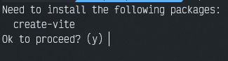

# Vite Scaffolding

## Vite instalation
First of all, we need to install the vite package to start creating projects. This we can do in two different ways: 
  - Standard installation: ```sudo apt-get install create-vite```
  - By creating a new vite project directly: ```npm init vite```.
If done this way,we'll get this message: 


To which we'll want to say yes.

