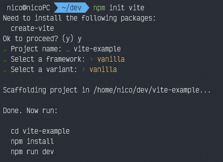

# Vite Scaffolding

## Vite installation
First of all, we need to install the vite package to start creating projects. This we can do in two different ways: 
  - Standard installation: ```sudo apt-get install create-vite```
  - By creating a new vite project directly: ```npm init vite```.
If done this way,we'll get this message: 


To which we'll want to say yes.

After the installation, a menu will appear, where we can choose our preferred options: 



Note: if you chose to install via standard instalation, you will need to run ```npm init vite``` to get the scaffolding built now.

Once the project is created we just have to follow the instructions to move into the folder and install the dependencies.

```
cd vite-example
npm install
```

## Directory structure

A common structure should look like this one: 
```
.
├── dist
├── package.json
├── package-lock.json
├── README.md
└── src
    ├── assets
    │   ├── asset1.svg
    │   └── asset2.jpg
    ├── css
    │   └── index.css
    ├── js
    │   └── main.js
    └── index.html

```

So a fast-way to get this structure done could be by deleting all files created by vite except for ```package.json ,package-lock.json, node-modules, .gitignore``` and running this on terminal: 
```
mkdir -p dist src/{css,js,assets}
touch src/js/index.js src/css/index.css src/index.html
```

## Vite configuration

Having done all this, there will be some problems when trying to build and deploy. To fix this, we will have to further configure Vite.

In order to do so, we will create a file at the project's root. 

#### Creating stylelint's config file

```touch vite.config.js```

#### Config file content

```
const path = require("path");
const mode = process.env.NODE_ENV === "production" ? "production" : "development";
const base = mode === "production" ? "/" + path.basename(process.cwd()) + "/" : "/";

module.exports = {
  root: "src",
  base,
  mode,
  publicDir: "../public",
  build: {
    outDir: "../dist",
    assetsDir: "./"
  }
};
```

This will set the ```src``` directory as root, so vite will look for our ```index.html``` there.

At this point,the basic scaffolding for the project is done.

## CSS Linter - Stylelint

### Installation

```npm i -D stylelint stylelint-config-standard```

The -D argument specifies we want to install stylelint as a development dependency only. This way, when people download or get our final product, they won't have stylelint installed as they won't need it.

### Configuration
#### Creating stylelint's config file
```touch .stylelintrc```

#### Config file content

```
{
  "extends": "stylelint-config-standard",
  "rules": {
    "declaration-colon-newline-after": "always-multi-line",
    "selector-type-no-unknown": null,
    "property-no-unknown": [
      true,
      {
        "ignoreProperties": [
          "content-visibility"
        ]
      }
    ],
    "selector-nested-pattern": "^&",
    "no-descending-specificity": null,
    "no-eol-whitespace": null,
    "declaration-empty-line-before": null
  }
} 
```

#### Script to run stylelint

We can create a script in our ```package.json``` like this one: 
```
"stylelint": "npx stylelint src/css/index.css"
```

So if we run ```npm run stylelint``` we'll get the linter's errors if existing.

## JS Linter - ESlint

To be continued... (Work In Progress)

## Deployment - Github Pages

To deploy our project to github pages we'll use the [gh-pages](https://www.npmjs.com/package/gh-pages) package.

### Installation
To install this as a development dependency in our project, we'll run: 

```npm i -D gh-pages``` 

### Deployment script
After our repository is initialized and properly linked to our remote repository, we can add a new script for development:

``` "deploy": "gh-pages -d dist"```

So now we just have to build our project and deploy it to Github Pages: 

```npm run build && npm run deploy```
