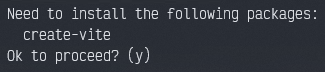

# Vite Scaffolding

## Vite instalation
First of all, we need to install the vite package to start creating projects, so we can do it in two different ways: 
  - Standard installation: ```sudo apt-get install create-vite```
  - Alternative installation: ```npm init vite```

On the alternative installation we'll get this message: 


And we'll say yes to install it.

